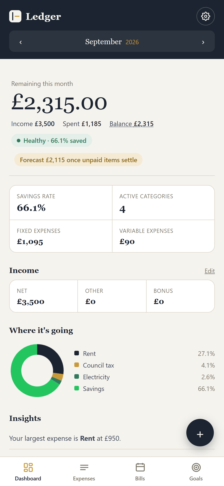
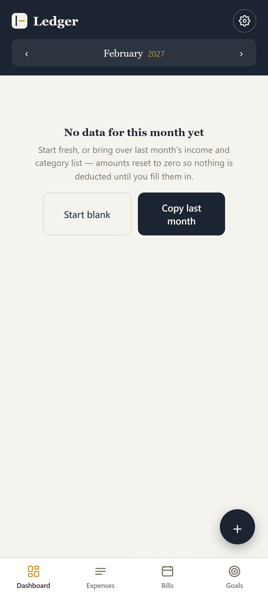
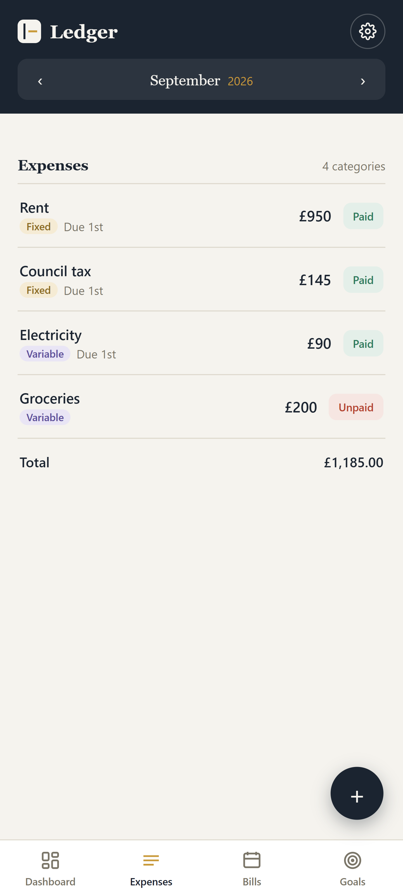
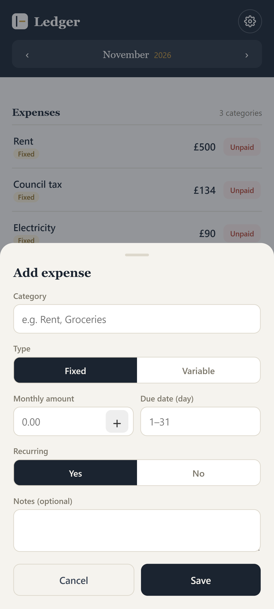
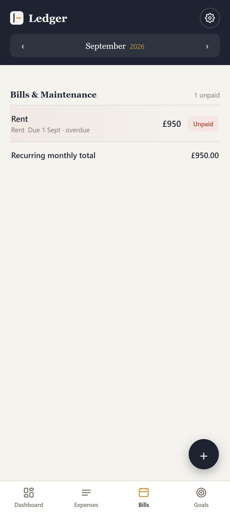
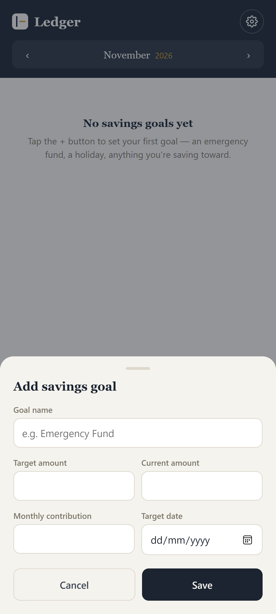
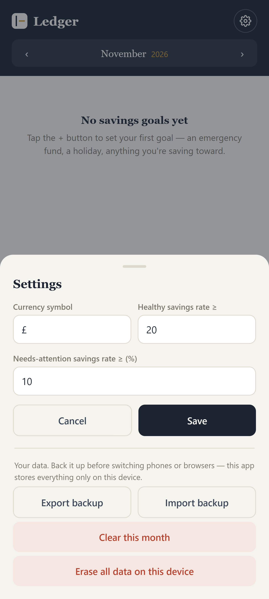

# Ledger
# Personal Finance Dashboard

> 📱 **Mobile-first personal finance management.**
>
> Designed primarily for smartphones, with a responsive interface that also works across tablets, laptops, and desktop devices.

A modern, installable **Progressive Web App (PWA)** for managing personal finances, tracking expenses and bills, monitoring savings goals, and understanding overall financial health.

The app turns the functionality of a traditional finance spreadsheet into a cleaner, interactive web experience — with automatic calculations, visual insights, financial-health indicators, and tools designed for everyday use.

## ✨ Features

### 📊 Financial Dashboard

A central overview of your financial position, designed to give you the information you need at a glance.

- Income tracking
- Total expenses
- Savings calculations
- Savings rate
- Key financial KPIs
- Financial health indicator
- Automatic financial insights
- What-If Calculator
- Emergency Fund Calculator

The financial health indicator provides an easy-to-understand **🟢 GREEN / 🟡 YELLOW / 🔴 RED** status based on your financial position and configured thresholds.

<table>
  <tr>
    <td align="center">
      
       
      <strong>Home tab</strong>
    </td>
    <td align="center">
      
       
      <strong>Copy from previous month</strong>
    </td>
  </tr>
</table>

## 💳 Expense Tracking

Track and categorize your spending without maintaining complicated spreadsheets.

Each expense can include:

- Category
- Expense type
- Amount
- Due date
- Paid status
- Recurring status

Expenses are automatically incorporated into your financial summaries and calculations.

The app also provides a visual breakdown of spending by category, making it easy to see where your money is going.

<table>
  <tr>
    <td align="center">
      
       
      Expenses tab
    </td>
    <td align="center">
      
       
      Add expenses
    </td>
  </tr>
</table>

## 📅 Annual Overview

See your finances across the year rather than looking at individual months in isolation.

The Annual Overview provides:

- Monthly spending
- Monthly financial performance
- Average spending
- Highest spending month
- Lowest spending month
- Average savings rate
- Year-level financial summaries

This makes it easier to identify spending patterns and understand how your finances change throughout the year.

## 🧾 Bills & Maintenance

Keep track of recurring financial commitments in one place.

Bills are automatically categorized by their current status:

- 🟢 **Paid**
- 🟡 **Due soon**
- 🔴 **Overdue**

This gives you an immediate view of upcoming commitments and anything that requires attention.

<table>
  <tr>
    <td align="center">
      
       
      <strong>Bills tab</strong>
    </td>
  </tr>
</table>

## 🎯 Savings Goals

Create and monitor your savings goals with clear visual progress tracking.

Use savings goals for things such as:

- Emergency funds
- Holidays
- Large purchases
- Investments
- Short-term savings
- Long-term targets

Visual progress indicators make it easy to see how close you are to reaching each goal.

<table>
  <tr>
    <td align="center">
      
       
      <strong>Savings tab</strong>
    </td>
  </tr>
</table>

⚙️ Settings

Centralized settings allow you to customize the experience without changing the underlying application logic.

<table>
  <tr>
    <td align="center">
      
       
      <strong>Savings tab</strong>
    </td>
  </tr>
</table>

### Configurable Areas

The application can be customized to suit your financial needs.

Configurable areas include:

- Expense categories
- Expense types
- Bill categories
- Payment methods
- Financial-health thresholds
- Other application preferences

## 📱 Progressive Web App

The application is built as a **Progressive Web App (PWA)**, giving it the convenience of a web application with the experience of an installable app.

You can use it directly from your browser and, on supported devices, install it to your device for quick access.

The responsive interface is designed to work across:

- 💻 Desktop
- 💻 Laptop
- 📱 Mobile
- 📲 Tablet

## ➕ Adding an Expense

Adding a new expense is designed to be quick and straightforward.

1. Open the **Expenses** section.
2. Add a new expense.
3. Enter the category and amount.
4. Select the relevant expense type.
5. Add any applicable due date, paid status, or recurring information.
6. Save the expense.

The new expense is automatically reflected throughout the application.

This includes:

- Dashboard totals
- Spending breakdowns
- Savings calculations
- Savings rate
- Financial health
- Financial insights
- Annual summaries

There is no need to manually update calculations when adding or changing expenses.

## 🧮 What-If Calculator

The What-If Calculator allows you to experiment with changes to your finances without altering your actual financial data.

Use it to explore scenarios such as:

- Increasing or decreasing income
- Changing monthly expenses
- Reducing variable spending
- Understanding the effect of different savings rates

It provides a quick way to understand how financial decisions could affect your overall financial position.

## 🛟 Emergency Fund Calculator

The Emergency Fund Calculator helps estimate how much money you may need to cover essential expenses during an unexpected interruption to income.

Use your relevant monthly expenses and preferred coverage period to estimate an appropriate emergency-fund target.

## 🎨 Financial Health

The app converts multiple financial metrics into an easy-to-understand financial-health status.

### 🟢 Green

Your finances are generally in a healthy position based on the configured thresholds.

### 🟡 Yellow

There are areas that may require attention or improvement.

### 🔴 Red

Your current financial position indicates that action may be required.

Financial-health thresholds can be customized from **Settings**.

## 📈 Automatic Insights

The dashboard doesn't just display numbers — it turns them into useful information.

Insights are generated from your financial data to highlight areas such as:

- Spending levels
- Savings performance
- Expense patterns
- Financial-health changes
- Potential areas for improvement

The goal is to make the application useful even if you don't want to spend time analyzing spreadsheets or raw financial data.

## 🧭 Application Structure

The application is organized around the main areas of personal financial management:

| Section | Purpose |
|---|---|
| **Dashboard** | Overall financial position and key insights |
| **Expenses** | Track and categorize spending |
| **Annual Overview** | Understand financial performance over time |
| **Bills & Maintenance** | Manage recurring financial commitments |
| **Savings Goals** | Track progress toward financial targets |
| **Settings** | Customize categories and financial thresholds |

## 🔄 Automatic Calculations

The application is designed so that users primarily enter **financial data**, while the application handles the calculations automatically.

Changing an input can automatically affect related:

- Totals
- Percentages
- Savings rates
- Financial-health status
- Insights
- Charts
- Annual summaries
- Goal progress

This keeps the experience focused on managing finances rather than maintaining calculations manually.

## 🧪 Testing

The application has been tested against a range of realistic financial-data changes, including:

- Adding new expenses
- Changing income
- Changing expense classifications
- Editing expense amounts
- Updating bill payment status
- Recalculating financial metrics
- Updating financial-health indicators
- Updating spending breakdowns

Testing is designed to ensure that changes made in one part of the application are correctly reflected throughout the rest of the financial dashboard.

🚀 Live App

The app is live and can be accessed here:

https://prajwal-patil-inc.github.io/Ledger/

No installation or setup is required — simply open the link in your browser and start using the app.

📲 Install the App

The app is a Progressive Web App (PWA), so you can install it on your phone and access it like a regular app.

Android — Google Chrome
Open the app in Google Chrome.
Tap the ⋮ three-dot menu in the top-right corner.
Select Add to Home screen or Install app.
Confirm by tapping Install or Add.
The app will appear on your Android home screen.

iPhone — Google Chrome
Open the app in Google Chrome.
Tap the Share button.
Scroll through the options and select Add to Home Screen.
Choose a name for the app if required.
Tap Add.
The app will appear on your iPhone home screen and can be opened like a regular app.

Note: PWA installation options can vary slightly depending on your browser and device version.

## 🔐 Financial Data

This application is intended as a personal finance management tool.

Users should consider the security and privacy characteristics of their chosen hosting and storage configuration before entering sensitive financial information.

> **Disclaimer:** Do not use the application as a replacement for professional financial advice.

## 🛠️ Customization

The application is designed to be adaptable as your financial needs change.

Possible customization areas include:

- Expense categories
- Expense types
- Bill categories
- Payment methods
- Financial-health thresholds
- Savings goals
- Dashboard metrics
- Visual styling
- Financial insights

## 🎯 Project Goals

The project aims to provide the simplicity of a spreadsheet with the usability of a dedicated finance application.

The core principles are:

- **Simple** — Financial data should be quick to enter.
- **Visual** — Important information should be understandable at a glance.
- **Automatic** — Users shouldn't have to maintain calculations manually.
- **Flexible** — Categories, thresholds, and goals should be customizable.
- **Responsive** — The experience should work across devices.
- **Installable** — The application should feel like a real app, not just a webpage.

## 📌 Project Status

**Status: Active**

The core personal-finance functionality is implemented, including:

- Dashboard
- Expense tracking
- Financial-health analysis
- Financial insights
- What-If calculations
- Emergency fund calculations
- Annual overview
- Bills tracking
- Savings goals
- Customizable settings
- Responsive PWA experience

The project can continue to evolve with additional analytics, visualizations, automation, and financial-planning features.

