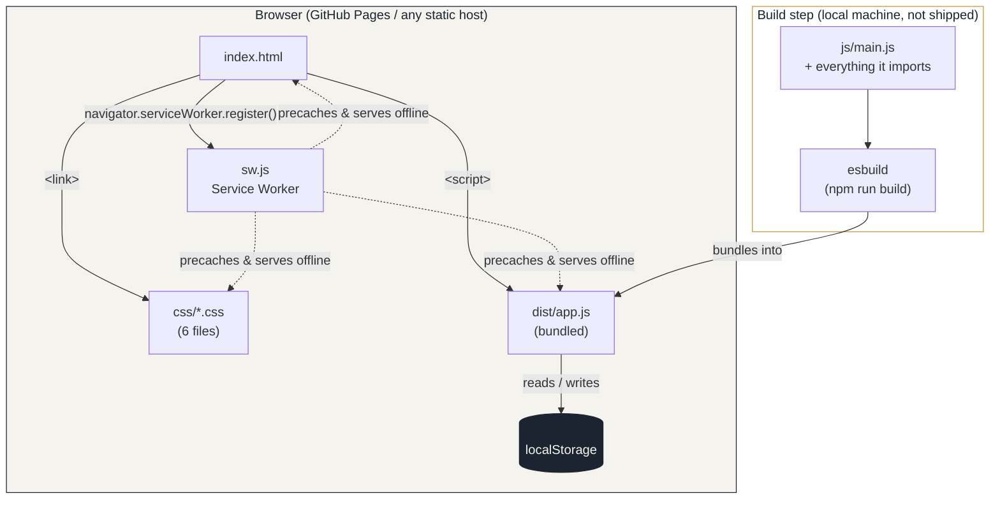
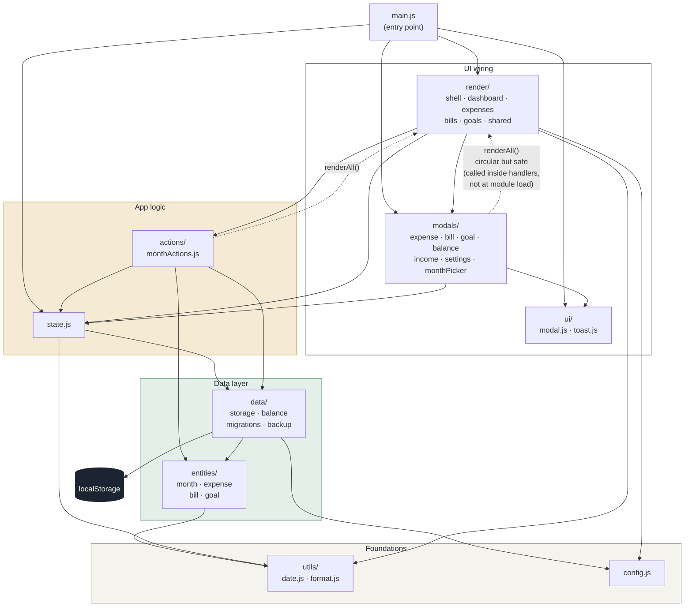

# Ledger — Technical Documentation

This documents the restructured codebase: every file, what it's responsible
for, what it imports/exports, and how data flows between them. It reflects
the project as split into `css/` and `js/` modules with an `esbuild` bundle
step (see `README.md` for the end-user feature list and `package.json` for
the build commands).

> Scope note: this describes the **current, restructured** version. The
> original single-file `app.js`/inline-`<style>` version is superseded by
> this structure but behaves identically from the user's point of view —
> same `localStorage` schema, same features.

---

## 1. High-level architecture



There is no backend, no API, no database. Every piece of data the app
shows lives in the browser's `localStorage` on that one device. `sw.js`
(a service worker) caches the static files so the app also works offline;
it does not cache or sync any user data.

---

## 2. File-by-file reference

### 2.1 Root files

| File | Role |
|---|---|
| `index.html` | The entire DOM shell. Top bar, the four `.view` containers (one per tab, filled in by JS), the FAB, the tab bar, the modal backdrop, and the toast element. Loads the 6 CSS files and the one JS bundle. Contains no logic of its own. |
| `manifest.json` | Standard PWA manifest (name, icons, theme colour, `display: standalone`). Referenced from `<link rel="manifest">` in `index.html`. |
| `sw.js` | Service worker. Precaches every static asset (`ASSETS` array) on install, and on `fetch` serves from cache first while updating the cache in the background ("stale-while-revalidate"). **Must be updated by hand** whenever a file is added/renamed/removed — nothing generates this list automatically. Cache name (`ledger-cache-v3`) must be bumped whenever the asset list changes, so old clients evict their stale cache. |
| `package.json` | One dev dependency (`esbuild`) and two scripts: `npm run build` (bundles `js/main.js` → `dist/app.js`) and `npm run watch` (same, rebuilds on save). |
| `dist/app.js` | **Generated file** — the output of `npm run build`. This is what `index.html` actually loads in production. It must be rebuilt and committed after any change under `js/`. |
| `README.md` | User/product-facing documentation (features, install instructions, live URL). |

### 2.2 `css/`

Plain CSS, no preprocessor, loaded as six separate `<link>` tags in a fixed
order (later files can override earlier ones):

| File | Contents |
|---|---|
| `variables.css` | `:root` custom properties — colour palette, radius, font stacks. Every other CSS file consumes these via `var(--x)`. |
| `base.css` | CSS reset, `html/body` sizing, base typography (`h1-h3`, `button` font inheritance). |
| `layout.css` | The app shell: `.app` (max-width 480px, centred), `.topbar`, `.brand`, `.month-switch`/`.month-label`, `.view` show/hide, `.fab`, `.tabbar`/`.tab-btn`. |
| `components.css` | Everything inside a tab's content: `.hero`, `.kpi-grid`, `.donut-wrap`/`.legend-*`, `.insight-row`, `.ledger-row` (expense/bill rows), `.goal-card`, `.empty-state`. |
| `modals.css` | The bottom-sheet modal (`.modal-backdrop`, `.modal`, slide-up animation), form fields (`.field`, `.seg`), buttons (`.btn-*`), the toast, and the "+" quick-add-amount control. |
| `calendar.css` | Just the month/year picker grid (`.cal-year-switch`, `.cal-month-grid`, `.cal-month-btn` and its `.today`/`.current`/`.has-data` state modifiers). |

### 2.3 `js/main.js` — entry point

The only file with top-level side effects. Responsibilities:

1. Imports `state` and the render/modal functions it needs to wire up.
2. `handleFab()` — the single "+" button's behaviour depends on which tab
   is active: Bills tab → `openBillModal(null)`; Goals tab →
   `openGoalModal(null)`; Dashboard/Expenses → `openExpenseModal(null)`.
   Also lazily creates the current month via `getOrCreateMonth()` if it
   doesn't exist yet (except on the Goals tab, which isn't month-scoped).
3. `shiftMonth(delta)` — used by the `‹`/`›` buttons; moves `state.cursor`
   by whole months via `setCursor()` and re-renders.
4. `init()` — runs once on load (or on `DOMContentLoaded` if the DOM
   wasn't ready yet):
   - `migrateLegacyGlobalBalance()` (one-off, see §2.5)
   - `ensureMonth()` + initial render
   - wires every static DOM event: prev/next month, tab buttons, FAB,
     settings button, the month label (click **and** keyboard Enter/Space,
     since it's `role="button"`), clicking the modal backdrop to close it
   - registers `sw.js` as the service worker (silently no-ops if that
     fails, e.g. unsupported browser)
5. Exposes `window.state = state` for debugging in devtools.

### 2.4 `js/state.js` — runtime state

```js
export const state = {
  cursor: Date,       // 1st of the currently-viewed month
  tab: "dashboard" | "expenses" | "bills" | "goals",
  settings: {...},     // from data/storage.js loadSettings()
  goals: [...],         // from data/storage.js loadGoals()
  month: Object|null,   // the currently-viewed month's data, or null if unsaved
  monthKey: "YYYY-MM",  // derived key for `month`
};
```

This is the **single in-memory object** every other module reads from and
writes to. It deliberately contains no rendering logic — it only loads,
derives, and persists. Key functions:

- `currentMK()` — `monthKey(state.cursor)`, e.g. `"2026-10"`.
- `setCursor(date)` — moves `state.cursor` to the 1st of that month and
  immediately persists the choice via `saveCursorKey()` (so re-opening the
  app resumes on the last-viewed month, not necessarily today's).
- `ensureMonth()` — reloads `state.month`/`state.monthKey` from storage for
  whatever `state.cursor` currently points at. Called at the top of every
  `renderAll()`.
- `getOrCreateMonth()` — like `ensureMonth()`, but if nothing is stored for
  this month yet, creates one via `freshMonthShell()` (see §2.5) and saves
  it immediately. Used when the user is about to *write* data (e.g. opening
  the "add expense" modal), not just view it.
- `persist()` — writes `state.month` back to `localStorage` under its key.
  Called after every mutation (toggling paid, saving a modal, etc.).

### 2.5 `js/config.js` — constants

Pure data, no logic: `DEFAULT_SETTINGS` (currency `£`, healthy/attention
savings-rate thresholds), `CATEGORY_PALETTE` (8 hex colours cycled for the
dashboard donut chart), `SAVINGS_COLOR`, `MONTH_NAMES_SHORT` (used by the
month picker).

### 2.6 `js/utils/`

| File | Exports | Notes |
|---|---|---|
| `date.js` | `monthKey`, `monthLabel`, `uid`, `todayISO`, `shiftDateToMonth`, `daysUntil`, `ordinalSuffix` | Pure functions, no imports from app state. `uid()` is `Date.now().toString(36) + random` — good enough for client-only IDs, not collision-proof under heavy concurrent use (irrelevant here, single user/device). `shiftDateToMonth` is what makes "copy last month" move a bill's due date into the new month while clamping day-of-month (e.g. the 31st → the 28th in February). |
| `format.js` | `fmt`, `fmt0`, `pct`, `escapeHtml` | `fmt`/`fmt0` read `state.settings.currency` — this is the **only** utils file that imports `state.js`, which is why it's split out from `date.js`. `escapeHtml` is used everywhere user-entered text (category names, notes, bill items) is interpolated into `innerHTML`, to prevent HTML injection from the user's own data. |

### 2.7 `js/entities/` — data shapes

These are factory functions, not classes — each returns a plain object
with sane defaults, used both when creating new records and (implicitly)
as documentation of the record shape.

| File | Shape produced |
|---|---|
| `expense.js` → `createExpense()` | `{ id, category, type: "Fixed"\|"Variable", amount, due, paid: "Yes"\|"No", recurring: "Yes"\|"No", notes }` |
| `bill.js` → `createBill()` | `{ id, item, category, cost, due, method, recurring, paid, renewal, notes }` |
| `goal.js` → `createGoal()` | `{ id, name, target, current, monthly, targetDate }` |
| `month.js` | `emptyMonth()` — the shape of one month's data (see §3.1); `totalIncome(m)`, `totalExpenses(m)` (sum of **Paid** expenses only), `totalByType(m, type)` (Paid expenses filtered by Fixed/Variable); `copyMonthStructure(prevData, prevKey, targetMonthDate)` — the "copy last month" logic: deep-clones the previous month, assigns fresh ids, resets every expense/bill to Unpaid, shifts bill due/renewal dates into the new month, and sets `balanceMode: "linked"` pointing at `prevKey`. |

All three "record" factories (expense/bill/goal) call `uid()` only when no
`id` is passed, so the same factory is reused for both create and edit
(edit passes `id: existing?.id`, so the id is preserved).

### 2.8 `js/data/` — persistence & derived data

| File | Responsibility |
|---|---|
| `storage.js` | **Every** `localStorage` read/write in the app goes through here (nowhere else touches `localStorage` directly, except `migrations.js` for one legacy key). Exposes `load/save` pairs for settings, goals, and months, plus `listMonthKeys()` (scans all keys for the `ledger_month_` prefix and returns them sorted), `previousMonthKeyBefore(key)` (the most recent stored month before a given key — powers "copy last month" and balance-linking), `deleteMonth`, `clearAllData`, and the last-viewed-cursor get/set. |
| `balance.js` | The balance engine. See §3.2 for the full model. `monthPaidTotal(m)` is just an alias for `totalExpenses(m)` (expenses marked Paid). `currentBalanceForKey(key, depth)` recursively resolves a month's live balance by walking the `balanceLinkedFrom` chain (depth-guarded at 240 to avoid an infinite loop if data ever gets corrupted into a cycle). `freshMonthShell(key)` builds a new empty month and, if an earlier month exists, auto-links it (`balanceMode: "linked"`) so a brand-new month doesn't wrongly start at £0. |
| `migrations.js` | `migrateLegacyGlobalBalance()` — a one-time upgrade for users who had the **pre-restructure, pre-per-month-balance** version of the app (which stored a single global `ledger_balance` number). Runs once (guarded by the `ledger_balance_migrated` flag), copies that old number into every existing month as its manual `balanceValue`, then sets the flag so it never runs again. |
| `backup.js` | `exportBackup()` — serialises `{settings, goals, months: {...every month...}}` to JSON and triggers a browser download via an in-memory `Blob` URL. `importBackup(data)` — the inverse: overwrites `state.settings`/`state.goals` and every month key present in the file. No validation beyond basic presence checks; a malformed file is expected to throw inside the caller's `try/catch` (see `settingsModal.js`). |

### 2.9 `js/actions/monthActions.js` — whole-month operations

Sits one layer above `state.js`: these functions mutate `state.month`,
`persist()` the result, and `renderAll()` to reflect it — something
`state.js` itself deliberately does not do (state.js has no render
dependency; see §4 on the module graph).

- `startMonthBlank({ silent })` — replaces `state.month` with a fresh
  shell. `silent: true` suppresses the toast (used internally by
  `resetMonthBlank`).
- `copyFromPreviousMonth()` — looks up the previous month, calls
  `copyMonthStructure()`, persists, re-renders, toasts. Returns `false`
  (and toasts "No previous month to copy from") if there's nothing to
  copy.
- `clearMonthExpenses()`, `resetMonthBlank()`, `resetMonthFromPrevious()`
  — **defined but not currently wired to any button in the UI.** They're
  kept here, fully working, for future use (e.g. a "..." menu on the
  dashboard). If you don't plan to use them, they're safe to delete.

### 2.10 `js/ui/` — shared dialog/toast plumbing

- `modal.js` — `showModal(html)` injects HTML into `#modalBody` (prefixed
  with the drag handle) and opens `#modalBackdrop`; `closeModal()` closes
  it. `wireSeg(id)`/`segValue(id)` turn a `.seg` button-row into a
  single-select control (used for Fixed/Variable, Recurring Yes/No, etc.)
  — `wireSeg` attaches the click handlers, `segValue` reads which one is
  `.active`.
- `toast.js` — `toast(msg)` sets `#toast`'s text, shows it, and hides it
  again after 1.8s (debounced via a single shared timer so rapid toasts
  don't stack).

### 2.11 `js/render/` — one file per tab, plus the shell

| File | Exports | What it draws |
|---|---|---|
| `shell.js` | `renderMonthLabel`, `switchTab`, `renderActiveView`, `renderAll` | Not a tab itself — the top-level orchestrator. `renderAll()` = `ensureMonth()` + `renderMonthLabel()` + `renderActiveView()`, and is the function almost everything else calls after a mutation. `switchTab()` toggles the active `.tab-btn`/`.view` classes and re-renders. |
| `shared.js` | `emptyMonthPrompt()` | One snippet of HTML ("No data for this month yet — go to Dashboard to start it") reused by the Expenses and Bills tabs when `state.month` is `null`. |
| `dashboard.js` | `renderDashboard`, `healthStatus` | The hero (remaining balance, income/spent/balance row, health chip, optional "forecast" chip for unpaid items), the KPI grid, the income breakdown, the spending donut (`drawDonut`, hand-rolled on a `<canvas>` — no charting library), and the auto-generated insight sentences. Also renders the **empty-month** state with "Start blank" / "Copy last month" buttons when `state.month` is null. `healthStatus(rate)` classifies a savings rate into Healthy/Needs attention/Overspending using `state.settings`'s thresholds. |
| `expenses.js` | `renderExpenses` | The expense list (one `.ledger-row` per expense), a Paid/Unpaid toggle per row, a running total, and tapping a row opens it for editing. |
| `bills.js` | `renderBills` | Same pattern as expenses, plus due-date urgency styling (`overdue` / `due-soon` row classes based on `daysUntil()`). |
| `goals.js` | `renderGoals` | One `.goal-card` per savings goal with a progress bar and an estimated months-to-target. Not month-scoped — reads `state.goals` directly. |

### 2.12 `js/modals/` — one file per dialog

All seven follow the same pattern: build an HTML string, `showModal()` it,
then attach `onclick` handlers to the buttons/inputs inside. Save handlers
validate minimally (e.g. category/name must be non-empty), build a record
via the matching `entities/*.js` factory, `Object.assign` it onto the
existing record if editing (in place, so other references stay valid) or
push it onto the array if new, `persist()`, `closeModal()`, `renderAll()`
(or a narrower re-render), `toast()`.

| File | Opens from | Notes |
|---|---|---|
| `expenseModal.js` | FAB (Dashboard/Expenses tabs), tapping an expense row | Category field has an HTML `<datalist>` autocomplete built from every category ever used across all stored months (`listMonthKeys()` + `loadMonth()`). Also contains the "+" quick-add-amount widget (a small inline adder that lets you add to the amount field without clearing it first). |
| `billModal.js` | FAB (Bills tab), tapping a bill row | Same CRUD pattern, plus a due date and optional renewal date. |
| `goalModal.js` | FAB (Goals tab), tapping a goal card | Not month-scoped — reads/writes `state.goals` directly and calls `saveGoals()`/`renderGoals()` rather than `persist()`/`renderAll()`. |
| `balanceModal.js` | Tapping the "Balance" figure on the dashboard hero | See §3.2 — saving always switches the month to `balanceMode: "manual"`, breaking any existing link. |
| `incomeModal.js` | "Edit" link next to the Income section on the dashboard | Three plain number fields (net/other/bonus) written onto `state.month.income`. |
| `settingsModal.js` | The gear icon in the top bar | Currency symbol + two threshold percentages; also hosts **Export backup**, **Import backup** (via a hidden `<input type="file">`), **Clear this month** (deletes just the current month's key), and **Erase all data on this device** (`localStorage.clear()` + resets in-memory settings/goals to defaults). Both destructive actions use the browser's native `confirm()`. |
| `monthPickerModal.js` | Tapping the month label in the top bar | Year switcher (`‹ year ›`) plus a 12-button month grid. Buttons are tagged `.has-data` (a month exists in storage), `.today` (the real current month), `.current` (the month currently being viewed) via CSS classes set at render time. Picking a month calls `setCursor()` + `renderAll()`. This is the feature added in the "jump to month" request earlier in this project. |

---

## 3. Data model

### 3.1 `localStorage` keys

| Key | Shape | Written by |
|---|---|---|
| `ledger_settings` | `{ currency, healthyRate, attentionRate }` | `data/storage.js saveSettings()` |
| `ledger_goals` | `Goal[]` | `data/storage.js saveGoals()` |
| `ledger_last_cursor` | `"YYYY-MM"` string | `data/storage.js saveCursorKey()`, via `state.js setCursor()` |
| `ledger_month_<YYYY-MM>` | one `Month` object per existing month (see below) | `data/storage.js saveMonth()`, via `state.js persist()` |
| `ledger_balance` *(legacy)* | a bare number | Pre-restructure version only; read once by `migrations.js`, never written by the current code |
| `ledger_balance_migrated` | `"1"` once migration has run | `data/migrations.js` |

**`Month` object** (`entities/month.js emptyMonth()`):

```js
{
  income: { net: 0, other: 0, bonus: 0 },
  savingsTarget: 0,          // present in the shape; not currently surfaced in the UI
  expenses: [ Expense ],
  bills: [ Bill ],
  balanceMode: "manual" | "linked",
  balanceValue: 0,            // used when balanceMode === "manual"
  balanceLinkedFrom: null | "YYYY-MM",  // used when balanceMode === "linked"
}
```

**`Expense`**: `{ id, category, type, amount, due, paid, recurring, notes }`
**`Bill`**: `{ id, item, category, cost, due, method, recurring, paid, renewal, notes }`
**`Goal`**: `{ id, name, target, current, monthly, targetDate }`

### 3.2 The balance model

This is the least obvious part of the codebase, so it's worth spelling out
precisely (it's also commented at the top of `data/balance.js`).

Each month's balance can work one of two ways:

- **`manual`** — `balanceValue` is a fixed number you typed in, directly.
- **`linked`** — the month has no anchor of its own. Its live balance is
  computed as *this month's income* **+** *the linked-from month's live
  balance*, recursively (`currentBalanceForKey` walks `balanceLinkedFrom`
  back as far as it goes).

Either way, whatever is currently marked **Paid** this month
(`monthPaidTotal`) is subtracted from that base figure, because that money
has genuinely left the account.

What this means in practice:
- A brand-new month is auto-`linked` to whichever month came before it
  (`freshMonthShell`), so it doesn't wrongly show £0 the moment you start
  it.
- "Copy last month" (`copyMonthStructure`) always sets the new month to
  `linked` → the previous month, for the same reason.
- Opening the Balance modal and saving a number always switches that month
  to `manual` and **detaches** it from whatever it was linked to. Any
  *later* month still linked through it will now resolve through this
  manual value instead — i.e. editing a balance part-way through the
  chain "re-bases" everything after it, by design.
- `currentBalanceForKey` is depth-guarded (240 hops) purely as a safety
  net against a corrupted/circular link chain; this should never trigger
  in normal use.

### 3.3 Why "paid" drives the numbers

Across the whole app, an expense/bill only counts toward the running
totals once it's marked **Paid**. This is deliberate: the dashboard's
"Remaining this month" and the live balance are meant to reflect money
that's actually moved, not money that's merely budgeted. The "Forecast"
chip on the dashboard (`balance − sum of unpaid expenses`) is the one
place that previews what happens once outstanding items do get paid.

---

## 4. Module dependency graph & a deliberate cycle

Most of the import graph is a straightforward layered stack:



…with one intentional exception: `render/shell.js` imports each tab's
render function (`dashboard.js`, `expenses.js`, etc.), and those files —
along with every file in `modals/` — import `renderAll` **back** from
`render/shell.js` so that saving a form can trigger a full re-render. That
is a genuine circular import (`shell.js → dashboard.js → monthActions.js
→ shell.js`, and similarly `shell.js → dashboard.js → incomeModal.js →
shell.js`).

This is safe under ES modules because every one of those references is
inside a function body, never evaluated at module load time — by the time
any of these functions actually run (a click, days after all modules
finished loading), every export is fully initialised. It was verified
working end-to-end (adding records, switching months, the picker, copy
last month) via a jsdom smoke test during development. It's flagged here
only so a future refactor doesn't "fix" the cycle without realising it's
load-bearing.

---

## 5. Key flows

### 5.1 App boot (`main.js init()`)

1. `migrateLegacyGlobalBalance()` — one-off, see §2.8.
2. `ensureMonth()` — loads whatever month `state.cursor` points to (resumed
   from `ledger_last_cursor`, or today's real month on a first-ever visit).
3. `renderMonthLabel()` + `renderActiveView()` — paints the initial screen
   (Dashboard tab by default).
4. DOM events wired: prev/next month, tab buttons, FAB, settings button,
   month label (click + keyboard), modal-backdrop-click-to-close.
5. Service worker registered (fire-and-forget).

### 5.2 Adding an expense

`FAB click` → `main.js handleFab()` → `getOrCreateMonth()` (creates the
month in storage if this is the first thing added this month) →
`openExpenseModal(null)` → user fills the form → save handler builds a
record via `createExpense()`, pushes it onto `m.expenses`, calls
`persist()` → `closeModal()` → `renderAll()` (reloads the month fresh from
storage and repaints the current tab) → `toast()`.

### 5.3 Jumping to a month via the picker

`monthLabel click` → `openMonthPickerModal()` builds the year/month grid
from `listMonthKeys()` (to mark which months already have data) → picking
a month calls `setCursor(date)` (updates `state.cursor` and persists
`ledger_last_cursor`) → `closeModal()` → `renderAll()`.

### 5.4 Copying last month's structure forward

Dashboard's empty-month state → "Copy last month" → `actions/
monthActions.js copyFromPreviousMonth()` → finds the previous stored month
via `previousMonthKeyBefore()` → `copyMonthStructure()` deep-clones it,
resets paid-status and ids, shifts bill dates, links the balance → saved
as the new `state.month` → `persist()` + `renderAll()`.

### 5.5 Backup / restore

Settings → Export: `exportBackup()` reads every month via
`listMonthKeys()`/`loadMonth()`, bundles with settings/goals into one JSON
file, triggers a browser download (no server involved).
Settings → Import: user picks a `.json` file → read via `FileReader` →
`importBackup()` overwrites matching `localStorage` keys → `renderAll()`.

---

## 6. Build & deploy

```bash
npm install        # once, installs esbuild
npm run build       # bundles js/main.js → dist/app.js (must be committed)
npm run watch        # same, rebuilds on every save, for active development
```

`index.html` only ever loads `dist/app.js` — never the files under `js/`
directly — so the app also works opened straight from disk (`file://`),
not just over `http(s)`. **Any change under `js/` requires a rebuild**
before it's visible; there is no dev server that watches and serves
unbundled modules.

Deploying is "commit the built files and push" — see the earlier
discussion in this conversation about rolling this out to the live GitHub
Pages site without disrupting existing users (service-worker cache
versioning, testing over `http`, etc.).

---

## 7. Known gaps / things to be aware of

- `clearMonthExpenses`, `resetMonthBlank`, `resetMonthFromPrevious`
  (`actions/monthActions.js`) are implemented but not wired to any button.
- `savingsTarget` exists in the `Month` shape (`entities/month.js
  emptyMonth()`) but nothing in the UI currently reads or writes it.
- `importBackup()` does only shallow presence checks (`if (data.settings)`,
  etc.) — a malformed or partially-shaped backup file could silently merge
  bad data rather than being rejected outright.
- The donut chart is hand-drawn on `<canvas>` with no library; if it ever
  needs new chart types, that's bespoke canvas code to extend, not a
  config change.
- `sw.js`'s `ASSETS` list is manual and must be kept in sync by hand with
  whatever `css/` and `dist/` actually contain; nothing generates it from
  the build.
